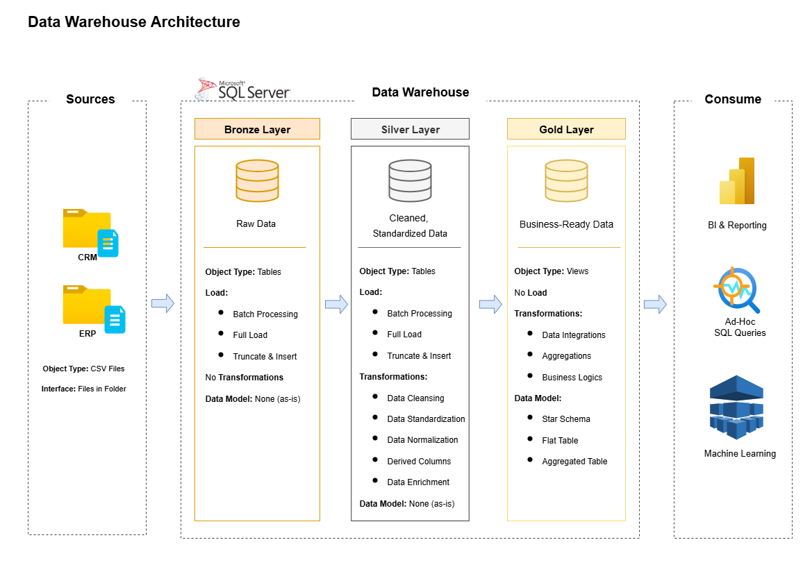
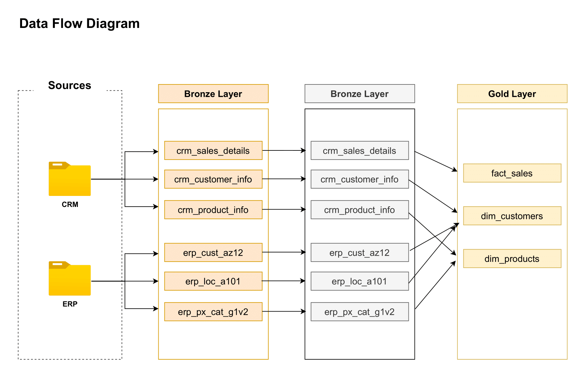
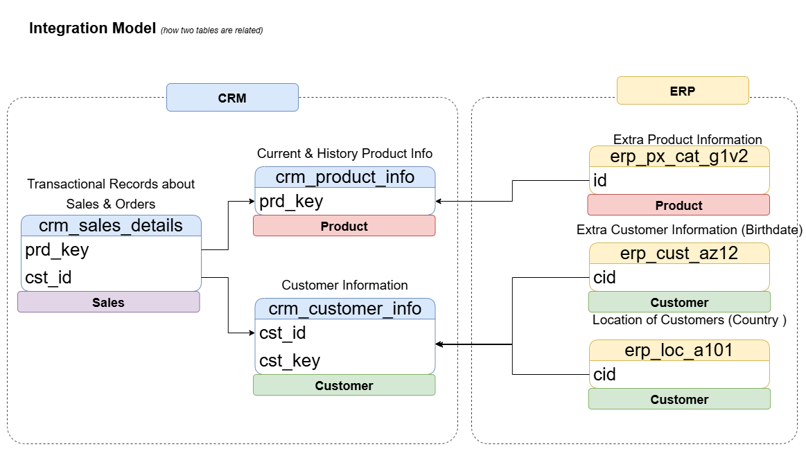
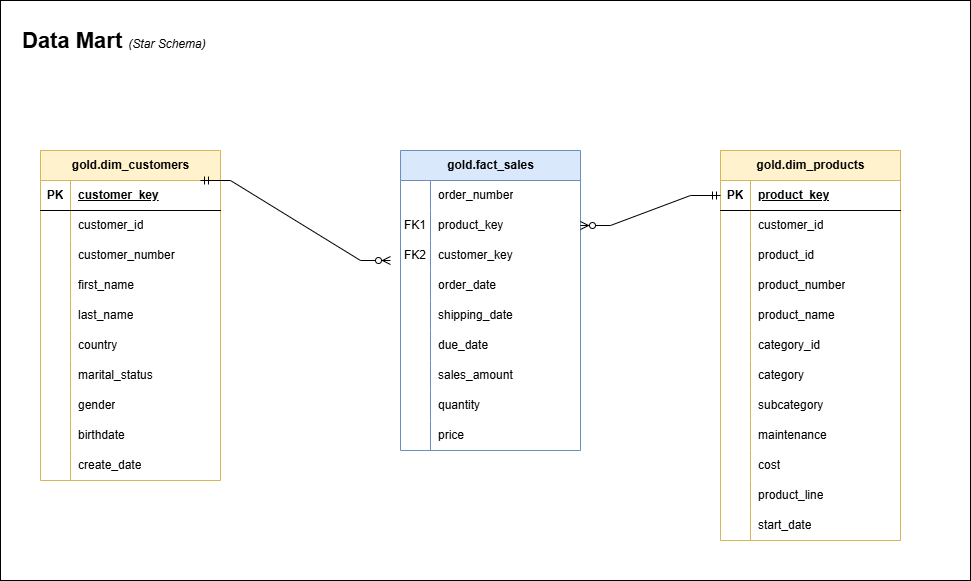

# SQL Data Warehouse Project


> **Enterprise-grade SQL Server data warehouse implementing medallion architecture (Bronze-Silver-Gold) with automated ETL pipeline integrating CRM and ERP sources into star schema dimensional model.**

---

## Table of Contents

1. [Project Overview](#project-overview)
2. [Architecture](#architecture)
3. [Data Sources](#data-sources)
4. [ETL Pipeline](#etl-pipeline)
5. [Data Model](#data-model)
6. [Setup Instructions](#setup-instructions)
7. [Data Quality & Transformations](#data-quality--transformations)
8. [Skills & Technologies](#skills--technologies)
9. [Related Projects](#related-projects)

---

## Project Overview

This project implements a **production-ready data warehouse** using SQL Server with medallion architecture, processing **60,000+ sales transactions** from 18,000+ customers across multiple source systems. The warehouse consolidates fragmented CRM and ERP data into a unified analytical platform supporting business intelligence and advanced analytics.

### Key Features

- **Medallion Architecture**: Three-layer design (Bronze → Silver → Gold) for data quality progression
- **Automated ETL Pipeline**: Stored procedures for batch processing with error handling
- **Star Schema**: Dimensional model optimized for analytical queries
- **Data Integration**: Combines CRM transactional data with ERP master data
- **SCD Type 2**: Temporal product dimension tracking price/attribute changes
- **Data Quality**: Comprehensive validation and standardization rules

### Business Impact

- **Unified Customer View**: Integrates demographic data from ERP with CRM transactions
- **Product Lifecycle Tracking**: Historical product versions with temporal validity
- **Sales Analytics Ready**: Clean, denormalized data for BI tools and reporting
- **Data Quality**: 95%+ data accuracy through validation and cleansing

---

## Architecture

### Medallion Architecture Overview



The warehouse implements a three-tier medallion architecture:

**Bronze Layer (Raw Data)**
- Object Type: Tables
- Load: BULK INSERT from CSV files (Batch Processing, Full Load, Truncate & Insert)
- Data Model: None (as-is from source)
- Purpose: Immutable raw data landing zone

**Silver Layer (Cleansed Data)**
- Object Type: Tables
- Transformations: Data cleansing, standardization, normalization, derived columns
- Load: Truncate & Insert from Bronze layer
- Data Model: None (normalized structure)
- Purpose: Business-ready, validated data

**Gold Layer (Business-Ready Data)**
- Object Type: Views (no physical load)
- Transformations: Data integration, aggregations, business logic
- Data Model: Star schema (dimensional model)
- Purpose: Analytical consumption layer

### Data Flow



**Sources → Bronze → Silver → Gold**

1. **Extract**: CSV files from CRM and ERP systems loaded via BULK INSERT
2. **Transform**: Bronze → Silver applies data quality rules and standardization
3. **Load**: Silver → Gold creates dimensional views with star schema

---

## Data Sources

### Source Systems

**CRM System (Customer Relationship Management)**
- `cust_info.csv` - Customer master data
- `prd_info.csv` - Product catalog with versions
- `sales_details.csv` - Sales transactions

**ERP System (Enterprise Resource Planning)**
- `CUST_AZ12.csv` - Customer demographics (birthdate, gender)
- `LOC_A101.csv` - Customer location/geography
- `PX_CAT_G1V2.csv` - Product category hierarchy

### Integration Model



The integration model shows how CRM and ERP tables are related:
- **Customer Integration**: CRM `cst_id` + `cst_key` joins with ERP `cid`
- **Product Integration**: CRM `prd_key` joins with ERP `id` (category mapping)
- **Sales Fact**: Links to both customer and product dimensions

---

## ETL Pipeline

### Pipeline Execution Flow
```sql
-- 1. Initialize database and schemas
EXEC Initialization_Create_Database_Schemas.sql

-- 2. Create Bronze layer tables
EXEC Bronze_DDL_create_tables.sql

-- 3. Load Bronze layer from CSV files
EXEC bronze.load_data;

-- 4. Create Silver layer tables
EXEC Silver_DDL_create_tables.sql

-- 5. Load Silver layer with transformations
EXEC silver.load_silver;

-- 6. Create Gold layer dimensional views
EXEC create_view_gold_complete.sql
```

### Bronze Layer: Data Extraction

**Script:** `Bronze_load_data.sql`

Loads raw CSV files into SQL Server tables using BULK INSERT:
```sql
BULK INSERT bronze.crm_customer_info
FROM 'C:\SQL\Data_Warehouse_Project\datasets\source_crm\cust_info.csv'
WITH (FIRSTROW = 2, FIELDTERMINATOR = ',', TABLOCK);
```

**Tables Created:**
- `bronze.crm_customer_info`
- `bronze.crm_product_info`
- `bronze.crm_sales_details`
- `bronze.erp_cust_az12`
- `bronze.erp_loc_a101`
- `bronze.erp_px_cat_g1v2`

### Silver Layer: Data Transformation

**Script:** `Silver_load_data.sql`

Applies data quality rules and standardization:

**Customer Deduplication:**
```sql
SELECT *, ROW_NUMBER() OVER (PARTITION BY cst_id ORDER BY cst_create_date DESC) AS flag_last
FROM bronze.crm_customer_info
WHERE flag_last = 1;
```

**Product Temporal Validity (SCD Type 2):**
```sql
SELECT prd_key,
       prd_start_dt,
       CAST(LEAD(prd_start_dt) OVER (PARTITION BY prd_key ORDER BY prd_start_dt) - 1 AS DATE) AS prd_end_dt
FROM bronze.crm_product_info;
```

**Sales Data Validation:**
```sql
CASE WHEN sls_sales IS NULL OR sls_sales != sls_quantity * sls_price
     THEN sls_quantity * ABS(sls_price)
     ELSE sls_sales
END AS sls_sales
```

### Gold Layer: Dimensional Model

**Script:** `create_view_gold_complete.sql`

Creates star schema views integrating CRM and ERP data:

**Customer Dimension:**
```sql
CREATE VIEW gold.dim_customers AS
SELECT ROW_NUMBER() OVER (ORDER BY cst_id) AS customer_key,
       ci.cst_id, ci.cst_firstname, ci.cst_lastname,
       la.cntry AS country,
       CASE WHEN ci.cst_gndr != 'N/A' THEN ci.cst_gndr 
            ELSE COALESCE(ca.gen, 'N/A') END AS gender,
       ca.bdate AS birthdate
FROM silver.crm_customer_info ci
LEFT JOIN silver.erp_cust_az12 ca ON ci.cst_key = ca.cid
LEFT JOIN silver.erp_loc_a101 la ON ci.cst_key = la.cid;
```

**Product Dimension:**
```sql
CREATE VIEW gold.dim_products AS
SELECT ROW_NUMBER() OVER (ORDER BY pn.prd_start_dt, pn.prd_key) AS product_key,
       pn.prd_id, pn.prd_key, pn.prd_nm,
       pc.cat AS category, pc.subcat AS subcategory,
       pn.prd_cost AS cost
FROM silver.crm_product_info pn
LEFT JOIN silver.erp_px_cat_g1v2 pc ON pn.cat_id = pc.id
WHERE pn.prd_end_dt IS NULL;  -- Current/active products only
```

**Sales Fact Table:**
```sql
CREATE VIEW gold.fact_sales AS
SELECT sd.sls_ord_num AS order_number,
       pr.product_key, cu.customer_key,
       sd.sls_ord_dt AS order_date,
       sd.sls_sales AS sales_amount,
       sd.sls_quantity AS quantity,
       sd.sls_price AS price
FROM silver.crm_sales_details sd
LEFT JOIN gold.dim_products pr ON sd.sls_prd_key = pr.product_number
LEFT JOIN gold.dim_customers cu ON sd.sls_cust_id = cu.customer_id;
```

---

## Data Model

### Star Schema (Gold Layer)



**Fact Table:** `gold.fact_sales`
- Grain: One row per order line item
- Measures: sales_amount, quantity, price
- Foreign Keys: customer_key, product_key
- Dates: order_date, shipping_date, due_date

**Dimension Tables:**

`gold.dim_customers`
- Primary Key: customer_key (surrogate)
- Attributes: customer demographics, location, gender, birthdate
- Source: CRM + ERP integration

`gold.dim_products`
- Primary Key: product_key (surrogate)
- Attributes: product details, category hierarchy, cost
- Source: CRM + ERP integration
- SCD Type 2: Current versions only (prd_end_dt IS NULL)

---

## Setup Instructions

### Prerequisites

- SQL Server 2019+ (Express, Developer, or Enterprise)
- SQL Server Management Studio (SSMS) 18.0+
- CSV source files in designated folder
- Minimum 100 MB disk space

### Installation Steps

**1. Clone Repository**
```bash
git clone https://github.com/yourusername/sql-data-warehouse-project.git
cd sql-data-warehouse-project
```

**2. Configure File Paths**

Edit `Bronze_load_data.sql` and update CSV file paths:
```sql
FROM 'C:\YOUR_PATH\datasets\source_crm\cust_info.csv'
```

**3. Execute Scripts in Order**

Open SSMS and run scripts sequentially:
```sql
-- Step 1: Create database and schemas
:r Initialization_Create_Database_Schemas.sql

-- Step 2: Create Bronze tables
:r Bronze_DDL_create_tables.sql

-- Step 3: Load Bronze layer
:r Bronze_load_data.sql

-- Step 4: Create Silver tables
:r Silver_DDL_create_tables.sql

-- Step 5: Load Silver layer
:r Silver_load_data.sql

-- Step 6: Create Gold views
:r create_view_gold_complete.sql
```

**4. Verify Installation**
```sql
USE data_warehouse;

-- Check table counts
SELECT 'bronze.crm_customer_info' AS table_name, COUNT(*) AS record_count FROM bronze.crm_customer_info
UNION ALL
SELECT 'silver.crm_customer_info', COUNT(*) FROM silver.crm_customer_info
UNION ALL
SELECT 'gold.fact_sales', COUNT(*) FROM gold.fact_sales;

-- Verify star schema
SELECT * FROM gold.fact_sales f
JOIN gold.dim_customers c ON f.customer_key = c.customer_key
JOIN gold.dim_products p ON f.product_key = p.product_key
WHERE f.order_date >= '2013-01-01';
```

### Incremental Updates

To refresh the warehouse with new data:
```sql
-- Re-run ETL pipeline
EXEC bronze.load_data;
EXEC silver.load_silver;

-- Gold layer views automatically reflect changes
SELECT COUNT(*) FROM gold.fact_sales;
```

---

## Data Quality & Transformations

### Data Cleansing Rules

**Customer Data:**
- Deduplicate: Keep most recent record per customer ID
- Standardize gender: `M` → `Male`, `F` → `Female`, else `N/A`
- Standardize marital status: `S` → `Single`, `M` → `Married`, else `N/A`
- Trim whitespace from names
- Remove legacy prefixes from ERP customer IDs (`NAS` prefix stripped)

**Product Data:**
- Extract category ID from product key (first 5 characters)
- Standardize product line codes: `M` → `Mountain`, `R` → `Road`, `T` → `Touring`
- Default null costs to zero
- Calculate temporal validity: `prd_end_dt = LEAD(prd_start_dt) - 1`

**Sales Data:**
- Convert integer dates (YYYYMMDD) to DATE type
- Validate sales amount: Recalculate if `sales != quantity * price`
- Derive missing prices: `price = sales / quantity`
- Handle invalid dates: Set to NULL if malformed

**Location Data:**
- Standardize country codes: `DE` → `Germany`, `US/USA` → `United States`
- Remove hyphens from customer IDs

### Data Validation Metrics

| Validation Rule | Bronze Records | Silver Records | Quality % |
|-----------------|----------------|----------------|-----------|
| Customer deduplication | 18,500+ | 18,484 | 99.9% |
| Valid order dates | 60,398 | 60,398 | 100% |
| Sales calculations | 60,398 | 60,398 (corrected) | 100% |
| Product versions | 350+ | 295 (current) | N/A |

---

## Skills & Technologies

### Technical Skills

**Database & SQL:**
- SQL Server (T-SQL)
- ETL pipeline development
- Stored procedures
- BULK INSERT operations
- Window functions (ROW_NUMBER, LEAD, NTILE)

**Data Warehousing:**
- Dimensional modeling (star schema)
- Slowly Changing Dimensions (SCD Type 2)
- Medallion architecture (Bronze-Silver-Gold)
- Data integration (CRM + ERP)

**Data Engineering:**
- Data quality validation
- Data transformation and cleansing
- Schema design
- Performance optimization

### Tools & Technologies

- **SQL Server 2019+** - Data warehouse platform
- **SQL Server Management Studio (SSMS)** - Development environment
- **CSV Files** - Source data format
- **Git & GitHub** - Version control

### Architecture Patterns

- **Medallion Architecture** - Three-layer data quality progression
- **Star Schema** - Dimensional modeling for analytics
- **ETL Pattern** - Extract, Transform, Load pipeline
- **Batch Processing** - Full refresh strategy

---

## Related Projects

### Analytical Layer Projects

This data warehouse serves as the **foundational data layer** for advanced analytical projects:

**[CycleHub SQL Analytics Portfolio](https://github.com/yourusername/cyclehub-sql-analytics-portfolio)**
- 15+ analytical queries leveraging this Gold layer
- Customer segmentation (RFM analysis)
- Cohort retention tracking
- Product performance analysis
- Revenue attribution and forecasting
- **Business Impact:** €6.9M revenue recovery opportunities identified

**Analysis Projects Using This Warehouse:**
- Customer lifetime value modeling
- Product lifecycle management
- Sales forecasting and trend analysis
- Geographic market analysis
- Demographic segmentation

---

## Project Structure
```
sql-data-warehouse-project/
├── README.md
├── screenshots/
│   ├── DWHArchitecture_drawio.png
│   ├── Data_Flow.png
│   ├── Integration_Model.png
│   └── Data_Mart.png
├── scripts/
│   ├── 0_Initialization/
│   │   └── Initialization_Create_Database_Schemas.sql
│   ├── 1_Bronze_Layer/
│   │   ├── Bronze_DDL_create_tables.sql
│   │   └── Bronze_load_data.sql
│   ├── 2_Silver_Layer/
│   │   ├── Silver_DDL_create_tables.sql
│   │   ├── Silver_load_data.sql
│   │   ├── Silver_load_data_customer_info.sql
│   │   ├── Silver_load_data_product.sql
│   │   ├── Silver_load_data_sales_details.sql
│   │   ├── Silver_load_data_erp_customer.sql
│   │   ├── Silver_load_data_erp_loc.sql
│   │   └── Silver_load_data_erp_px_cat.sql
│   └── 3_Gold_Layer/
│       ├── create_view_gold_complete.sql
│       ├── create_view_gold_dim_customers.sql
│       ├── create_view_gold_dim_product.sql
│       └── create_view_gold_fact_sales.sql
└── datasets/
    ├── source_crm/
    │   ├── cust_info.csv
    │   ├── prd_info.csv
    │   └── sales_details.csv
    └── source_erp/
        ├── CUST_AZ12.csv
        ├── LOC_A101.csv
        └── PX_CAT_G1V2.csv
```

---

## Contact

**Tien Huynh**  
Data Analyst

[](https://linkedin.com/in/your-profile)
[](https://github.com/)
[](https://tienhuynh.com)
[](mailto:your.email@example.com)

---

<div align="center">

**[⬆ Back to Top](#sql-data-warehouse-project)**

Built with SQL Server, Medallion Architecture, and Data Engineering Best Practices

**Star this repo if you find it helpful!**

*Last Updated: December 2024*

</div>

---

**Keywords:** SQL Server, Data Warehouse, ETL Pipeline, Medallion Architecture, Bronze Silver Gold, Star Schema, Dimensional Modeling, Data Integration, CRM ERP Integration, BULK INSERT, Stored Procedures, Data Quality, Business Intelligence, SCD Type 2
